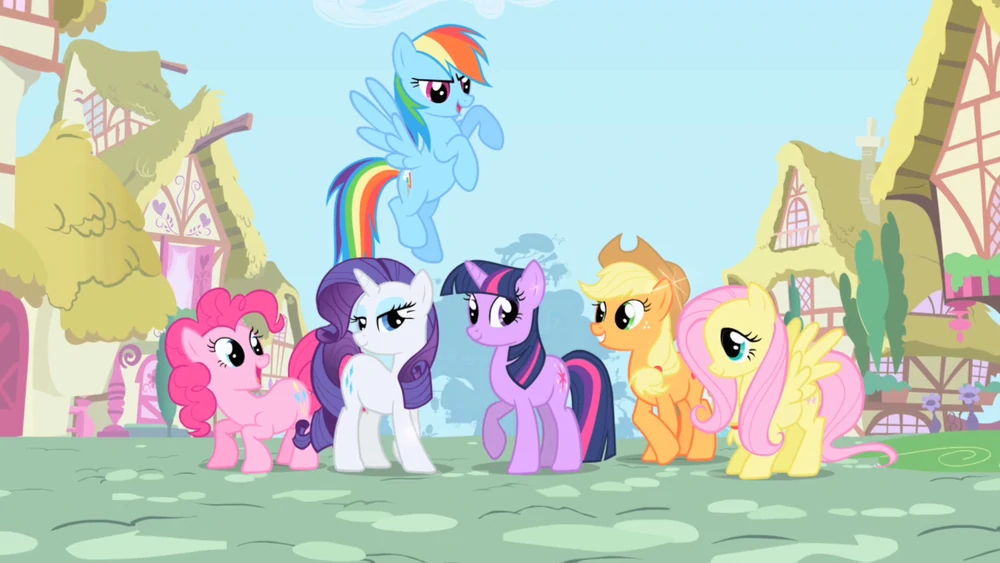

<div class="scroll-tracker"></div>

本文是下面的 Youtube 视频的学习笔记。在这篇文章中，主要讲述了如何实现最顶上的“进度条”，以及图片的“上浮翻转”效果。这两个都是与“scroll”事件有关，所以需要用到 javascript.



<div class="image-holder">
    
</div>

首先，定义一个 `div.scroll-tracker`，它有`height`、`background-color`CSS属性，定义位置为 `position: fixed;`和`inset: 0 0 auto`，这样它就能固定显示在顶端。为了确保它在最上面，还可以定义 `z-index: 999;`

然后引入 [`scroll-timeline.js`](https://github.com/flackr/scroll-timeline)，然后javascript如下：

```js
const scrollTracker = document.querySelector(".scroll-tracker"); //选中元素

const scrollTrackingTimeline = new ScrollTimeline({
    // source 和 orientation 都是默认选项
    source: document.scrollingElement, //需要监测的 scoll 元素
    orientation: "block", //需要监测的 scoll 方向
    scrollOffsets: [CSS.px(250), CSS.percent(100)] //需要监测的 scoll 的开始和结束
});

scrollTracker.animate(
    {
        transform: ["scaleX(0)", "scaleX(1)"], //开始和结束的变形
    },
    {
        // duration: 1, //在这里不需要，因为动画的时间与 timeline 相关
        timeline: scrollTrackingTimeline, //上面定义的 timeline
    },
);
```

但定义完上面的后，`scaleX(0)` 是从中间开始向两边伸展的，所以在 CSS 中还要加上 `transform-origin: left;`，这就搞定了。

对于图片也是类似的，不过要选择所有图片：

```js
const animatedImages = document.querySelectorAll('.image-rotate-in')
```

然后用 forEach 设置每个图片，设置过程也是类似的，需要注意的是 scrollOffsets 的设置方法，要计算图片顶部在页面中的位置。

```js
animatedImages.forEach((image) => {
    const imageOffsetTop = image.offsetTop;
    const imageOffsetHeight = image.offsetHeight;

    image.animate(
        {
            transform: ["perspective(1000px) rotateX(45deg)", "perspective(1000px) rotate(0)"],
            opacity: ["0.5", "1"]
        },
        {
            duration: 1,
            timeline: new ScrollTimeline({
                scrollOffsets: [
                    CSS.px(imageOffsetTop+imageOffsetHeight-window.innerHeight-200),
                    CSS.px(imageOffsetTop-300)
                ]
            })
        }
    );
});
```

上面的方法最强大，我们可以随意定义动画开始/结束的位置，但是要计算。如果不想计算，也可以用下面这种 scrollOffsets。`end` 实际指的是 view port 的下面，这样当图片进入 view port 时，动画开始。如果希望图片“完全”进入 view port 才开始动画，那么可以设置 threshold=1。[Bramus' interactive offset visualizer](https://codepen.io/bramus/pen/OJbZbaX) 可以说明 threshold 的作用。

```js
scrollOffsets: [
    // animate start at the end(bottom) of the viewport, and end at the start(top) of the viewport
    { target: image, edge: "end", threshold: "0" },
    { target: image, edge: "start", threshold: "0" }
]
```

<div class="image-holder">
    
</div>

<link rel="stylesheet" type="text/css" href="static/style.css" />
<script src="static/script.js" type="module" defer></script>